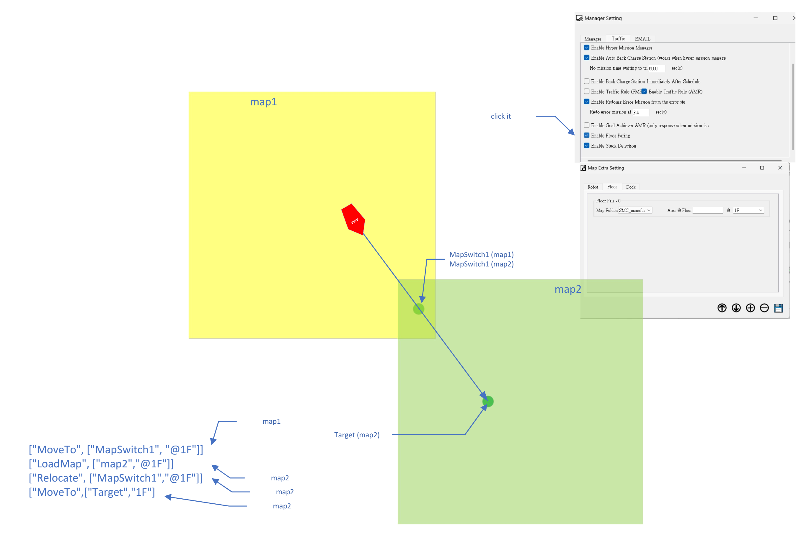

# Mission Dispatch API Documentation

This system provides an HTTP API to dispatch robot missions.

---

## Mission Dispatch API

### API Endpoint
```
POST http://127.0.0.1:6600/set_mission
```

Use this API to submit a complete mission.

---

## Mission Structure

A mission consists of the following main components:

- `task_arr`: List of actions (multiple actions allowed, actions can be reused)
- `robot_mode`: Extra device control for the robot (applies to the entire mission, not individual actions)

---

## task_arr (Action List)

`task_arr` is an array where each element represents a single action.

### Example
```json
"task_arr": [
  ["MoveTo", [-19.1, 28.48, -3.14, "1F"]],
  ["MoveTo", ["N100", "1F"]],
  ["FollowRail", ["rail_No.345", 0, 700, "1F"]],
  ["ButtonWait", 0]
]
```

### Description
- A mission can contain multiple actions
- Actions can be freely combined and repeated
- The example above contains **4 actions** in a single mission

---

## robot_mode (Robot Device Mode)

`robot_mode` controls additional robot devices.

### Format
```json
"robot_mode": [0, 0, 0]
```

### Value Definition
- `0`: Off
- `1`: On

### Device Order
```
[ Upper UV Light, Lower UV Light, Vacuum ]
```

---

## Notes

- Extra robot devices (`robot_mode`) are **mission-level settings**
- They apply to the entire mission lifecycle
- They do **not** change per individual action

---

## Map Extension Workflow



This diagram illustrates how map extension is performed during robot navigation.

### Workflow Description

1. The robot starts on **Map 1** and navigates to an intermediate waypoint located on Map 1.
2. Upon reaching this relay point, the system triggers the loading of **Map 2**.
3. After Map 2 is loaded, the robot performs **re-localization** to determine its correct spatial position within the new map.
4. Once the correct pose on Map 2 is established, the robot continues navigation toward the target point defined on **Map 2**.

This process enables seamless navigation across extended or segmented maps while maintaining accurate localization.

---

## How to Use FMS RESTful API (Video)

[YouTube](https://www.youtube.com/watch?v=hHIqWNY6VT4)

---
