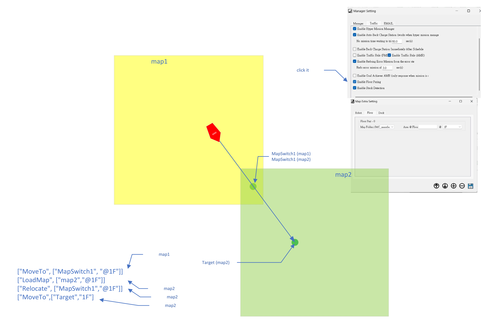

# Mission Dispatch API Documentation

This system provides an HTTP API to dispatch robot missions.

---

## Mission Dispatch API

### API Endpoint
```
POST http://127.0.0.1:6600/set_mission
```

Use this API to submit a complete mission.

---

## Mission Structure

A mission consists of the following main components:

- `task_arr`: List of actions (multiple actions allowed, actions can be reused)
- `robot_mode`: Extra device control for the robot (applies to the entire mission, not individual actions)

---

## task_arr (Action List)

`task_arr` is an array where each element represents a single action.

### Example
```json
"task_arr": [
  ["MoveTo", [-19.1, 28.48, -3.14, "1F"]],
  ["MoveTo", ["N100", "1F"]],
  ["FollowRail", ["rail_No.345", 0, 700, "1F"]],
  ["ButtonWait", 0]
]
```

### Description
- A mission can contain multiple actions
- Actions can be freely combined and repeated
- The example above contains **4 actions** in a single mission

---

## robot_mode (Robot Device Mode)

`robot_mode` controls additional robot devices.

### Format
```json
"robot_mode": [0, 0, 0]
```

### Value Definition
- `0`: Off
- `1`: On

### Device Order
```
[ Upper UV Light, Lower UV Light, Vacuum ]
```

---

## Notes

- Extra robot devices (`robot_mode`) are **mission-level settings**
- They apply to the entire mission lifecycle
- They do **not** change per individual action

---

## Map Extension Workflow



This diagram illustrates how map extension is performed during robot navigation.

### Workflow Description

1. The robot starts on **Map 1** and navigates to an intermediate waypoint located on Map 1.
2. Upon reaching this relay point, the system triggers the loading of **Map 2**.
3. After Map 2 is loaded, the robot performs **re-localization** to determine its correct spatial position within the new map.
4. Once the correct pose on Map 2 is established, the robot continues navigation toward the target point defined on **Map 2**.

This process enables seamless navigation across extended or segmented maps while maintaining accurate localization.

---

## How to Use FMS RESTful API (Video)

[YouTube](https://www.youtube.com/watch?v=hHIqWNY6VT4)

---


# MCS (Material Control System) 說明文件 (AMR配合 roller 以及 modbus 通訊的範例)

本文件詳細說明如何透過 FMS Restful API 設定 AMR 的目標點，並透過 Modbus 與 I/O 指令完成自動化物料搬運任務。

---

## 1. 導航與目標點設定
在建立地圖時，需預先在 FMS 系統中定義目標點名稱。設定完成後，即可透過 FMS Restful API 要求 AMR 前往該目標點。

* **搬運起點 (Start Station)**：目標點名稱設定為 `start`。
* **搬運終點 (End Station)**：目標點名稱設定為 `end`。

---

## 2. 任務範例與交涉邏輯

### AMR 接收物品 (上貨流程)
當 AMR 到達 A 站點後，執行以下程序以接收貨物：
1.  **到位通知**：對 `modbus_a_server` 的寄存器 `#40002` 寫入值 `1`，代表 AMR 已到位。
2.  **滾輪收貨**：執行 `ExtOutputSetMuti` 指令啟動 AMR 自體滾輪旋轉。
3.  **確認上貨**：透過 `ExtInputWaitMuti` 等待訊號，確認物料已進入 AMR (Magazine 上貨完成)。
4.  **停止收貨**：關閉輸出以停止滾輪，並對 `#40002` 寫入值 `2` 表示接收完成。
5.  **狀態歸零**：延遲 1 秒後將 `#40002` 狀態歸 `0`。

### AMR 推送物品 (下貨流程)
當 AMR 到達 B 站點後，執行以下程序將貨物卸載：
1.  **等待站點就緒**：讀取 `modbus_b_server` 的 `#40004`，確認數值為 `0`。
2.  **到位通知**：對 `#40003` 寫入值 `1`。
3.  **確認入籃許可**：等待站點將 `#40004` 變更為 `1` (代表站點允許入籃)。
4.  **執行下貨**：對 `#40003` 寫入值 `2` 並啟動滾輪。
5.  **確認完成**：等待貨物離開感應器，停止滾輪並將 `#40003` 狀態歸 `0`。

---

## 3. 指令參數詳細說明

### SetModbusDoubleCheck (寫入指令)
要求 AMR 對特定 Modbus 位址設定數值，並持續檢查直到確認成功寫入。

* **寄存器地址 (Address)**：採 **N-1** 換算規則。
    * 例如：操作 `#40002` 時，指令內地址應填 `1`。
* **Timeout**：設定逾時時間（單位為秒），`-1.0` 代表永久等待直到成功。

### WaitModbusSingleEqual (讀取等待指令)
要求 AMR 持續讀取數值，直到符合預期目標值才繼續執行後續任務。

* **寄存器地址 (Address)**：同樣採 **N-1** 換算。
    * 例如：監控 `#40004` 時，指令內地址應填 `3`。

---

## 4. 相關連結
* [SetModbusDoubleCheck 原始碼說明](https://github.com/funrobot0804/fms-restful-api/blob/main/SetModbusDoubleCheck.py)
* [WaitModbusSingleEqual 原始碼說明](https://github.com/funrobot0804/fms-restful-api/blob/main/WaitModbusSingleEqual.py)
