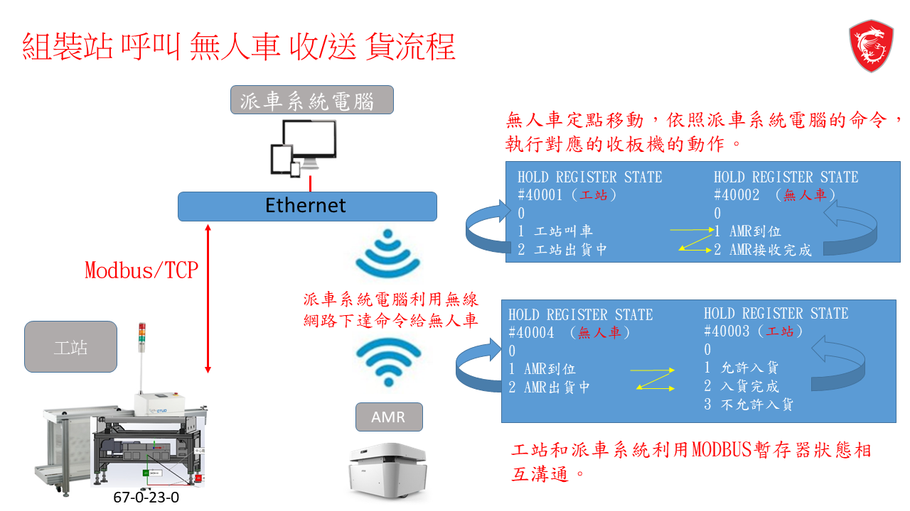
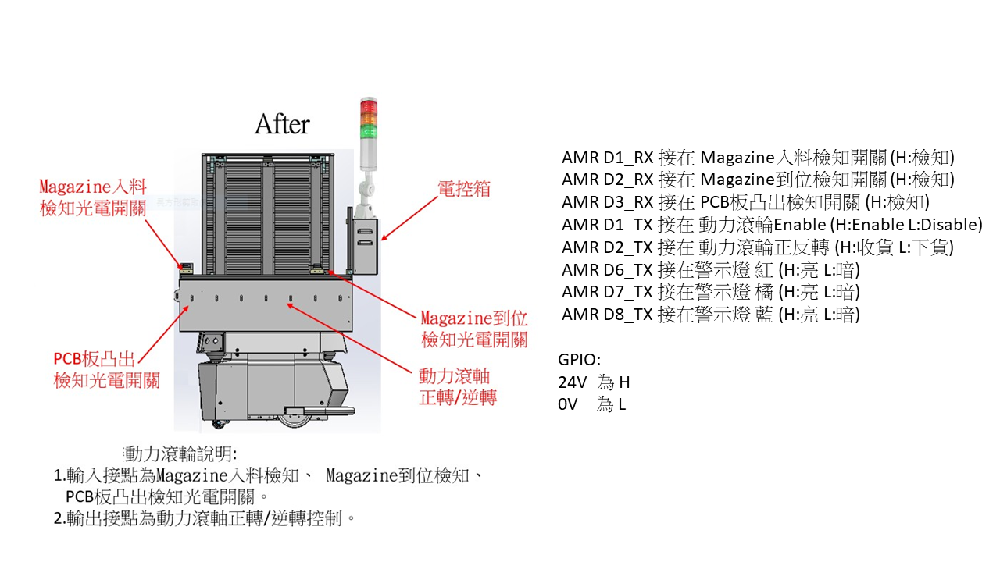

# Mission Dispatch API Documentation

This system provides an HTTP API to dispatch robot missions.

---

## Mission Dispatch API

### API Endpoint
```
POST http://127.0.0.1:6600/set_mission
```

Use this API to submit a complete mission.

---

## Mission Structure

A mission consists of the following main components:

- `task_arr`: List of actions (multiple actions allowed, actions can be reused)
- `robot_mode`: Extra device control for the robot (applies to the entire mission, not individual actions)

---

## task_arr (Action List)

`task_arr` is an array where each element represents a single action.

### Example
```json
"task_arr": [
  ["MoveTo", [-19.1, 28.48, -3.14, "1F"]],
  ["MoveTo", ["N100", "1F"]],
  ["FollowRail", ["rail_No.345", 0, 700, "1F"]],
  ["ButtonWait", 0]
]
```

### Description
- A mission can contain multiple actions
- Actions can be freely combined and repeated
- The example above contains **4 actions** in a single mission

---

## robot_mode (Robot Device Mode)

`robot_mode` controls additional robot devices.

### Format
```json
"robot_mode": [0, 0, 0]
```

### Value Definition
- `0`: Off
- `1`: On

### Device Order
```
[ Upper UV Light, Lower UV Light, Vacuum ]
```

---

## Notes

- Extra robot devices (`robot_mode`) are **mission-level settings**
- They apply to the entire mission lifecycle
- They do **not** change per individual action

---

## Map Extension Workflow


This diagram illustrates how map extension is performed during robot navigation.

### Workflow Description

1. The robot starts on **Map 1** and navigates to an intermediate waypoint located on Map 1.
2. Upon reaching this relay point, the system triggers the loading of **Map 2**.
3. After Map 2 is loaded, the robot performs **re-localization** to determine its correct spatial position within the new map.
4. Once the correct pose on Map 2 is established, the robot continues navigation toward the target point defined on **Map 2**.

This process enables seamless navigation across extended or segmented maps while maintaining accurate localization.

---

## How to Use FMS RESTful API (Video)

[YouTube](https://www.youtube.com/watch?v=hHIqWNY6VT4)

---


# MCS (Material Control System) 說明文件 (AMR配合 roller 以及 modbus 通訊的範例)

本文件詳細說明如何透過 FMS Restful API 設定 AMR 的目標點，並透過 Modbus 與 I/O 指令完成自動化物料搬運任務。




---

## 1. 導航與目標點設定
在建立地圖時，需預先在 FMS 系統中定義目標點名稱。設定完成後，即可透過 FMS Restful API 要求 AMR 前往該目標點。

* **搬運起點 (Start Station)**：目標點名稱設定為 `start`。
* **搬運終點 (End Station)**：目標點名稱設定為 `end`。

---
### 任務範例：前往 A 站點 (起點)   

'''  
Mission_2A_station=[                           
    ["MoveTo_TrafficNetwork",["start","map_name"], "Rail"], // 透過軌道 PP   
    ["DockTo",["start-dock","map_name"]]                    // AMR 停靠 A-station   
]  
'''  

### 任務範例：前往 B 站點 (終點)  

'''  
Mission_2B_station=[                           
    ["MoveTo_TrafficNetwork",["end","map_name"], "Rail"],   // 透過軌道 PP   
    ["DockTo",["end-dock","map_name"]]                     // AMR 停靠 B-station   
]  
'''  


## 2. 任務範例與交涉邏輯


### AMR 接收物品 (上貨流程)
當 AMR 到達 A 站點後，執行以下程序以接收貨物：
1.  **到位通知**：對 `modbus_a_server` 的寄存器 `#40002` 寫入值 `1`，代表 AMR 已到位。
2.  **滾輪收貨**：執行 `ExtOutputSetMuti` 指令啟動 AMR 自體滾輪旋轉。
3.  **確認上貨**：透過 `ExtInputWaitMuti` 等待訊號，確認物料已進入 AMR (Magazine 上貨完成)。
4.  **停止收貨**：關閉輸出以停止滾輪，並對 `#40002` 寫入值 `2` 表示接收完成。
5.  **狀態歸零**：延遲 1 秒後將 `#40002` 狀態歸 `0`。
  
'''  
Mission_A_station_Ship=[  
    ["SetModbusDoubleCheck",["modbus_a_server",502],[1,"HOLD_REG"],[1,1,1],-1.0],   // 1: AMR到位 (#40002:1)   
    ["ExtOutputSetMuti", [0,1,2,3], [1,1,0,0] ],                                    // 滾輪開始收貨   
    ["ExtInputWaitMuti", [0,1], [0,1] , -1.0],                                      // 確認上貨完成 [0,1] bit0:0 bit1:1
    ["ExtOutputSetMuti", [0,1,2,3], [0,0,0,0] ],                                    // 停止滾輪   
    ["SetModbusDoubleCheck",["modbus_a_server",502],[1,"HOLD_REG"],[1,1,2],-1.0],   // 2: AMR接收完成 (#40002:2)   
    ["TimeWait", 1.0 ],                                               
    ["SetModbusDoubleCheck",["modbus_a_server",502],[1,"HOLD_REG"],[1,1,0],-1.0],   // 0: 狀態歸零 (#40002:0)
    ["ExtInputWaitMuti", [0,1], [0,1] , -1.0]                                       // 確認入口感應器狀態   
]  
'''  


### AMR 推送物品 (下貨流程)
當 AMR 到達 B 站點後，執行以下程序將貨物卸載：
1.  **等待站點就緒**：讀取 `modbus_b_server` 的 `#40004`，確認數值為 `0`。
2.  **到位通知**：對 `#40003` 寫入值 `1`。
3.  **確認入籃許可**：等待站點將 `#40004` 變更為 `1` (代表站點允許入籃)。
4.  **執行下貨**：對 `#40003` 寫入值 `2` 並啟動滾輪。
5.  **確認完成**：等待貨物離開感應器，停止滾輪並將 `#40003` 狀態歸 `0`。
  
'''  
Mission_B_station_Restock=[  
    ["WaitModbusSingleEqual",["modbus_b_server",502],[1,"HOLD_REG"],[3,0], -1.0],   // 等待站點就緒 (#40004:0)   
    ["SetModbusDoubleCheck",["modbus_b_server",502],[1,"HOLD_REG"],[2,1,1],-1.0],   // 1: AMR到位 (#40003:1)   
    ["WaitModbusSingleEqual",["modbus_b_server",502],[1,"HOLD_REG"],[3,1], -1.0],   // 等待站點允許入籃 (#40004:1)   
    ["SetModbusDoubleCheck",["modbus_b_server",502],[1,"HOLD_REG"],[2,1,2],-1.0],   // 2: AMR出籃中 (#40003:2)   
    ["ExtOutputSetMuti", [0,1,2,3], [1,0,0,0] ],                                    // 滾輪開始下貨
    ["ExtInputWaitMuti", [0,1], [0,0] , -1.0],                                      // 等待下貨完成   
    ["TimeWait", 3.0 ],
    ["ExtOutputSetMuti", [0,1,2,3], [0,0,0,0] ],                 
    ["SetModbusDoubleCheck",["modbus_b_server",502],[1,"HOLD_REG"],[2,1,0],-1.0]    // 0: 狀態歸零 (#40003:0) 
]   
'''  

---

## 3. 指令參數詳細說明

### SetModbusDoubleCheck (寫入指令)
要求 AMR 對特定 Modbus 位址設定數值，並持續檢查直到確認成功寫入。

* **寄存器地址 (Address)**：採 **N-1** 換算規則。
    * 例如：操作 `#40002` 時，指令內地址應填 `1`。
* **Timeout**：設定逾時時間（單位為秒），`-1.0` 代表永久等待直到成功。

### WaitModbusSingleEqual (讀取等待指令)
要求 AMR 持續讀取數值，直到符合預期目標值才繼續執行後續任務。

* **寄存器地址 (Address)**：同樣採 **N-1** 換算。
    * 例如：監控 `#40004` 時，指令內地址應填 `3`。

---

## 4. HTTP Restful API 新增

### check_on_point (檢查AMR是否在指定點位上)
```
url = "http://127.0.0.1:6600" + "/check_on_point"
payload = {
            "robot_name": "msi_default",   # AMR 名稱

            "name": "dock_0",              # 點位名稱（Target 或 Dock 的名稱）

            "type": "dock",                # "target" - 目標點位
                                           # "dock"   - 充電站

            "range": 0.2,                  # 判斷距離閾值，單位：公尺(m)
                                           # 參考點與點位的直線距離 <= range 時回傳 True

            "offset": -0.4                 # 可選，預設 0.0
                                           # 將計算用的參考點沿 AMR 的正面方向（X 軸）偏移
                                           # 單位：公尺(m)
                                           # 正值 → 往 AMR 前方移動
                                           # 負值 → 往 AMR 後方移動
                                           # 範例：offset = status.center2front
                                           #        → 參考點移至 AMR 前端中心
            }

r = requests.post(url, data=json.dumps(payload))
```

### set_mission 新增 group 參數 
當所有指定group的任務做完後才會觸發自動回充電站

```
url = "http://127.0.0.1:6600"+"/set_mission"
payload = { "start_time":float( time.time() ),    # 格式為float，西元1970年後所經過的浮點秒數(UTC)
            "using_time":float(300),              # 格式為float，任務欲使用的浮點秒數
            "userid":int(15938),                  # 格式為int，下命令者的userid
            "robot_type":int(0),                  # 格式為int，欲使用的robot type (垃圾車、送餐車、送衣服車...)
            "robot_mode":[0,0,0],                 # 格式為list，0 => off
                                                  #             1 => on
                                                  # [上UV燈、下UV燈、吸塵器]

            "robot_name": "msi_default",            # 格式為str，指定機器的名字，如果有指定就只會挑選特定名稱的機器

            "group": int(2),                      # 格式為int，任務所屬的群組編號
                                                  # -1  => 不屬於任何群組 (預設值，行為與舊版相同)
                                                  # 0,1,2,3... => 群組編號
                                                  #
                                                  # 用途：當AGV電量不足時，若當前任務屬於某個群組(group != -1)，
                                                  #       console會等到該群組內所有任務都完成後，才讓AGV去充電，
                                                  #       避免中途打斷同批次的任務。
                                                  #       若group為-1，則電量不足時立刻中斷任務去充電(舊行為)。

            # MoveTo指令格式
            #
            # 指定前往目的地，可使用'座標點'或是'目的地名稱'
            #
            #["MoveTo",[x(float,單位:m), y(float,單位:m), a(float,單位:rad), floor(字串)]]
            #["MoveTo",[target name(字串), floor(字串)]]
            "task_arr":[ ["MoveTo_TrafficNetwork", ["chamber_A", "saa_0320@1F"], "Rail"],
                         ["MoveTo_TrafficNetwork", ["chamber_B", "saa_0320@1F"], "Rail"]
                       ]

            }
r = requests.post(url, data=json.dumps(payload))
```
### get_mission 新增 group 參數
如果使用此API的時候有使用 **負數** index，請注意讀取順序

```
    回傳資料格式
    {
        'result':'success',          # 會有'success'和'fail'兩字串，'success'代表console端沒錯誤，'fail'代表console端可能有錯誤
        
        'value':{'unfinish':         # 有'unfinish'和'finish'兩種字串，端看當時POST的'category' 
                 [
                    ['3',  '2/2', 'Simulator_104', '1592209639', '60 sec', '[15938,1592209639]', '[-1,-1.0]', '0', '[0 0 0]', "[[-19.1, 28.48, -3.14, '1F'], [-5.04, 3.66, -0.0, '1F']]", 'none', "1F","50","3","1"],
                    ['5', '-1/2', 'Simulator_104', '1592209639', '60 sec', '[15938,1592209639]', '[-1,-1.0]', '0', '[0 0 0]', "[[-19.1, 28.48, -3.14, '1F'], [-5.04, 3.66, -0.0, '1F']]", 'none', "2F","40","4","-1"]
                 ] 
                }
        }
        
        
    task error會回傳以下可能字串:
        "none" => '等待執行'或'執行中'，並未有錯誤發生
        "script error" => 傳到AGV上的task python腳本發生錯誤，發生的原因: 1. AGV上的python安裝有問題、
                                                                          2. AI報錯導致腳本出錯
        "ai error" => 發生的原因: 1.可能有人透過另一個console來操作機器人
                                  2.AGV被插上Joystick，搶走控制權

        "no error" => '正常結束'，過程中沒有出任何錯誤
        "busy error" => 機器正在忙，無法執行此任務
        "already error" => 之前的錯誤尚未解除，不能執行此任務 (除非POST至'http://127.0.0.1:6600/recover_error'以解除錯誤)
        "lowbattery error" => 電量不足，不能執行此任務

    task的回傳list各欄位索引說明:
        [0]  mission index    - 任務編號 (str)
        [1]  task step        - 當前執行步驟/總步驟數 (str)
        [2]  AGV name         - 被指派的AGV名稱 (str)
        [3]  start time       - 任務開始時間 UTC timestamp (str)
        [4]  using time       - 任務使用時間 (str)
        [5]  booking id&time  - [下命令者userid, 下命令時間] (str)
        [6]  cancel id&time   - [取消者userid, 取消時間] (str)
        [7]  AGV type         - AGV類型 (str)
        [8]  AGV mode         - AGV模式 [上UV燈,下UV燈,吸塵器] (str)
        [9]  task array       - 任務指令陣列 (str)
        [10] mission error    - 錯誤訊息 (str)
        [11] start floor      - 任務起始樓層 (str)
        [12] work time        - 任務已執行時間(秒) (str)
        [13] work distance    - 任務已行走距離 (str)
        [14] group            - 任務群組編號，-1表示不屬於任何群組 (str)
```

## 5. 相關連結
* [SetModbusDoubleCheck 原始碼說明](https://github.com/funrobot0804/fms-restful-api/blob/main/SetModbusDoubleCheck.py)
* [WaitModbusSingleEqual 原始碼說明](https://github.com/funrobot0804/fms-restful-api/blob/main/WaitModbusSingleEqual.py)


